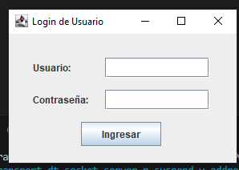
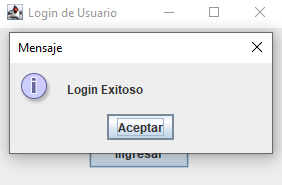
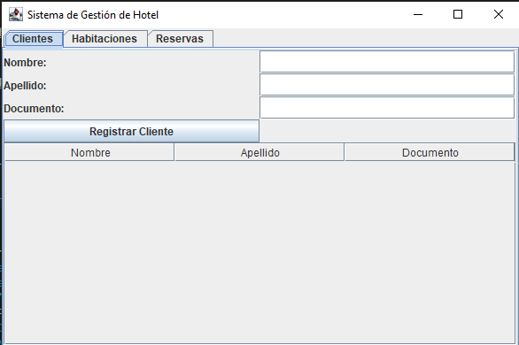
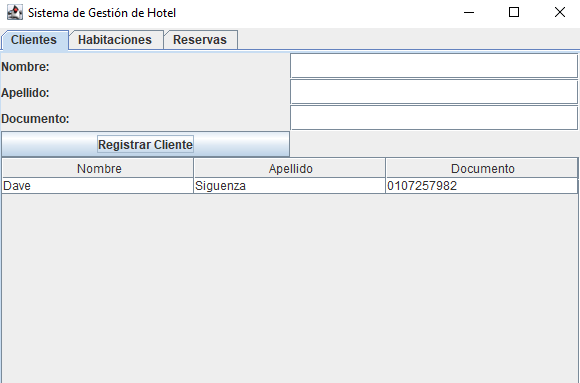
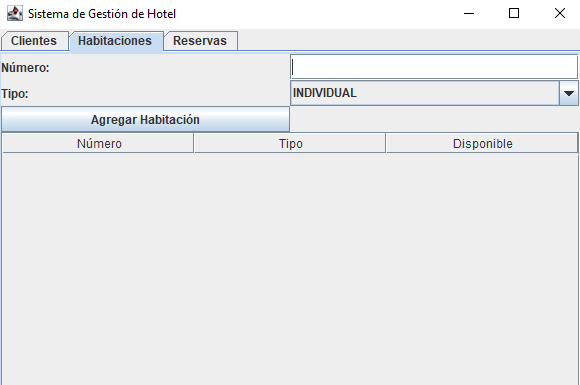
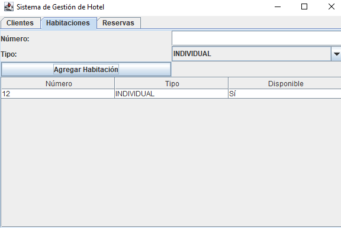
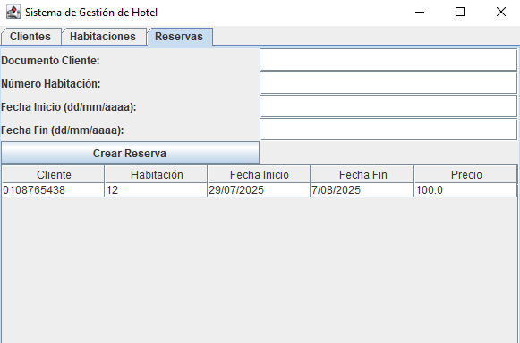
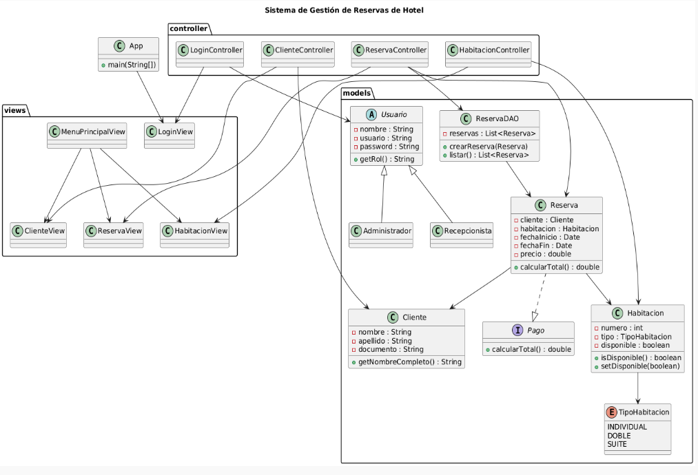

# 🏨 Sistema de Gestión de Reservas de Hotel

## 👥 Integrantes
- Dave Fernando Siguenza Vallejo (dsiguenzav@est.ups.edu.ec)

---

## 📌 Descripción
Aplicación de escritorio en **Java Swing** bajo arquitectura **MVC**, que permite:
- Registrar clientes.
- Gestionar habitaciones (crear, ver disponibles/ocupadas).
- Crear y listar reservas (check-in / check-out).
- Persistencia de datos básica en memoria (simulable a archivos o SQLite).

---

## 🚀 Requisitos
- Java 11+
- Librerías estándar de Java (Swing, AWT).
- (Opcional) SQLite JDBC Driver para persistencia futura.

---

## ⚙️ Instrucciones de uso
1. **Clonar repositorio:**
   ```bash
   git clone [https://github.com/Davesoo/Examen-Final-POO-Dave-Siguenza.git]
2. **Capturas de pantalla:**

    Login (Usuario: admin - Contraseña: 1234)

    

    Login Exitoso

    

    Clientes

    

    Clientes Registro

    

    Habitaciones

    

    Habitación Reservada

    

    Cuadro de Reservas

    

    Reservas solicitadas

    

## Diagrama UML


