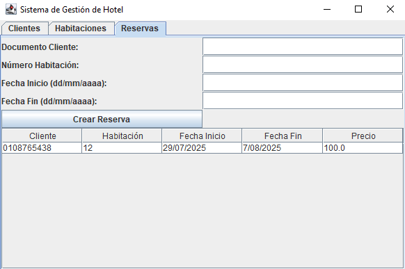

# 🏨 Sistema de Gestión de Reservas de Hotel

## 👥 Integrantes
- Dave Fernando Siguenza Vallejo (dsiguenzav@est.ups.edu.ec)

---

## 📌 Descripción
Aplicación de escritorio en **Java Swing** bajo arquitectura **MVC**, que permite:
- Registrar clientes.
- Gestionar habitaciones (crear, ver disponibles/ocupadas).
- Crear y listar reservas (check-in / check-out).
- Persistencia de datos básica en memoria (simulable a archivos o SQLite).

---

## 🚀 Requisitos
- Java 11+
- Librerías estándar de Java (Swing, AWT).
- (Opcional) SQLite JDBC Driver para persistencia futura.

---

## ⚙️ Instrucciones de uso
1. **Clonar repositorio:**
   ```bash
   git clone [url]
2. **Capturas de pantalla:**

    Login
    Usuario: admin
    Contraseña: 1234
    

    Login Exitoso
    

    Clientes
    

    Clientes Registro
    

    Habitaciones
    

    Habitación Reservada
    

    Cuadro de Reservas
    

    Reservas solicitadas
    

## Diagrama UML
┌────────────────────────┐
│        Usuario         │<<abstract>>
│------------------------│
│ - nombre: String       │
│ - usuario: String      │
│ - password: String     │
│------------------------│
│ + getRol(): String     │
└───────────▲────────────┘
            │
 ┌──────────┴──────────┐
 │                     │
 │Recepcionista        │
 │Administrador        │
 └─────────────────────┘

┌────────────────────────┐
│        Cliente         │
│------------------------│
│ - nombre: String       │
│ - apellido: String     │
│ - documento: String    │
│------------------------│
│ + getNombreCompleto()  │
└────────────────────────┘

┌────────────────────────┐
│       Habitacion       │
│------------------------│
│ - numero: int          │
│ - tipo: TipoHabitacion │
│ - disponible: boolean  │
│------------------------│
│ + isDisponible()       │
└────────────────────────┘

┌────────────────────────┐
│        Reserva         │<<implements Pago>>
│------------------------│
│ - cliente: Cliente     │
│ - habitacion: Habitacion│
│ - fechaInicio: Date    │
│ - fechaFin: Date       │
│ - precio: double       │
│------------------------│
│ + calcularTotal():double│
└────────────────────────┘

┌────────────────────────┐
│        Pago (I)        │
│------------------------│
│ + calcularTotal():double│
└────────────────────────┘

┌────────────────────────┐
│     ReservaDAO         │
│------------------------│
│ - reservas: List       │
│------------------------│
│ + crearReserva(r)      │
│ + listar(): List       │
└────────────────────────┘

Enum: TipoHabitacion { INDIVIDUAL, DOBLE, SUITE }